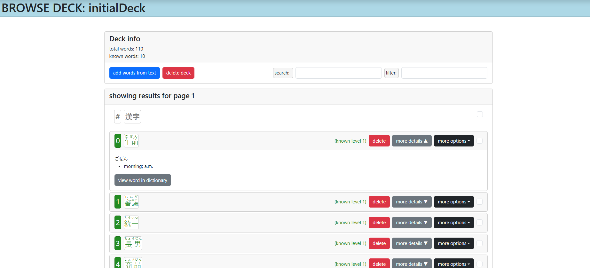
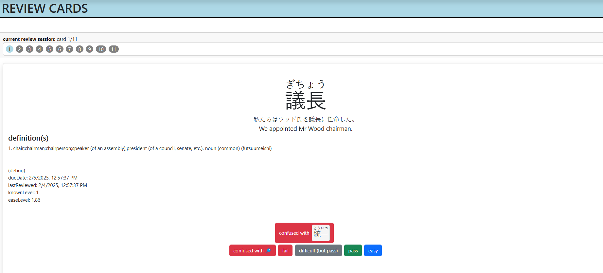
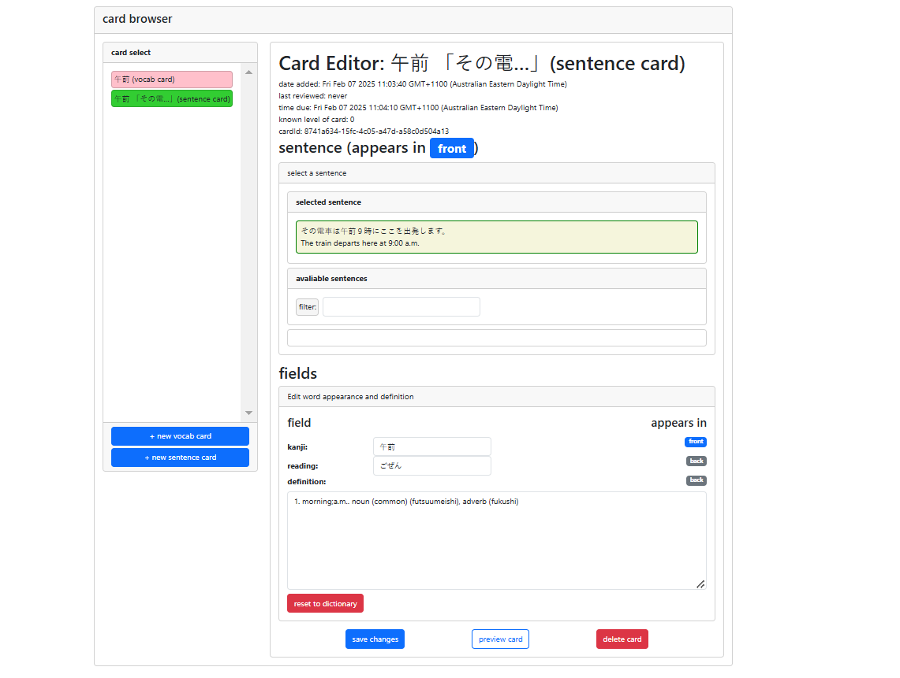
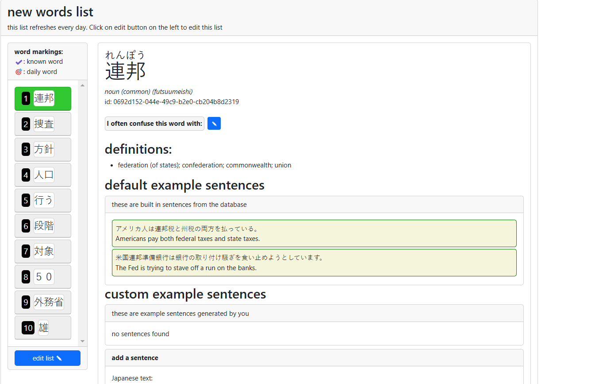

# jpdict (dev)
Renshuu (or formally jpdict) is a japanese dictionary browser and flash card creator. The project aims to be a SRS flashcard review system specialized for japanese. The features and review structure was designed carefully, by reviewing many other free online japanese learning resources of similar style, and combining their features based on the owner's preferences. 
**Features**:
- Manage vocabulary decks.
- Extract words from natural text to create / add to a deck.
- Create flashcards for vocabulary entries. Multiple flashcards can be created for an entry.
- Utilize a modified version of the supermemo2 SRS algorithm to review flashcards.
- Automatic calculation of known levels of vocabulary entries based on reviews.
- Ability to mark entries as "similar", which gives more options for card grading.

**Credits**:
- Japanese dictionaries used: 
    - JMDict: https://www.edrdg.org/jmdict/j_jmdict.html
- Japanese text extractor:
    - Mecab: https://taku910.github.io/mecab/, with it's python3 wrapper https://pypi.org/project/mecab-python3/
- This project is heavily inspired by kanshudo (https://www.kanshudo.com/) and jpdb (jpdb.io)

# screenshots
deck browser:

card review:

card editor:

new word recommendation list:

